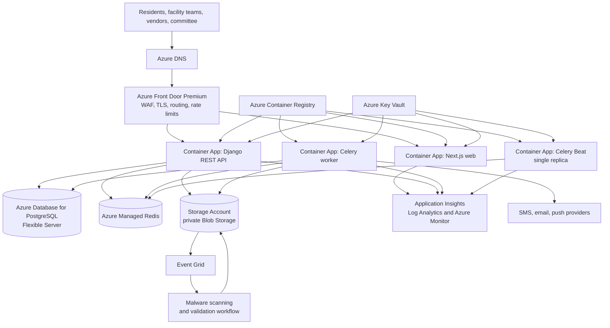

# NivasOps Azure Cloud Architecture

**Status:** Proposed target architecture; not an infrastructure deployment plan  
**Last reviewed:** 2026-08-28  
**Scope:** Azure target architecture for NivasOps web, API, workers, data, attachments, security, operations, and planned scale-out components.

## 1. Executive Summary

NivasOps is a multi-tenant residential-society operations platform built with a Next.js web client, Django/DRF API, Celery workers, PostgreSQL, and Redis. The application enforces tenant isolation in PostgreSQL with composite tenant foreign keys, transaction-local `app.society_id`, and forced row-level security (RLS).

The recommended Azure production baseline is:

- **Azure Front Door Premium with WAF** as the public edge.
- **Azure Container Apps** for the Next.js web runtime, Django API, Celery worker, and single Celery Beat process.
- **Azure Database for PostgreSQL Flexible Server** for the authoritative transactional database.
- **Azure Managed Redis** for the cache, Celery broker, and Celery result backend.
- **Azure Blob Storage** for future private ticket attachments, service certificates, estimates, exports, and evidence.
- **Azure Key Vault**, **managed identities**, **Azure Monitor/Application Insights**, and **Log Analytics** for security and operations.

Blob Storage is the correct storage class for the planned binary content. It must not be exposed as a public file store or used before attachment authorization, quarantine, malware scanning, and metadata lifecycle rules exist.

## 2. Current State and Architecture Status

| Component | Current state | Azure target | Notes |
|---|---|---|---|
| Web client | Implemented Next.js application | Azure Container Apps web service behind Front Door | Use a Node runtime unless the frontend is intentionally constrained to static export. |
| API | Implemented Django/DRF API | Azure Container Apps API service | Stateless API replicas; tenant context is set inside the database transaction. |
| Background work | Celery is implemented and validated | Azure Container Apps worker and Beat services | Worker is horizontally scalable; Beat must remain singleton. |
| Database | Azure PostgreSQL integration is in use | Azure Database for PostgreSQL Flexible Server | PostgreSQL is authoritative. Forced RLS must remain enabled for every tenant table. |
| Cache/broker | Azure Redis integration is in use | Azure Managed Redis | Current application uses TLS Redis URLs and distinct logical databases/key prefixes. |
| Attachments | Not yet implemented | Azure Blob Storage | Phase 7 work; no Django media/storage configuration exists today. |
| Container images | Not yet configured | Azure Container Registry | Private image source for Container Apps. |
| Edge/WAF | Not yet configured | Azure Front Door Premium with WAF | Public entry point, managed TLS, routing, rate limiting, and WAF policy. |
| Secrets | Local environment configuration and ephemeral Entra database tokens are used | Azure Key Vault with managed identity references | Production secrets must not be stored in container configuration or source control. |
| Observability | Structured JSON logs exist | Application Insights, Log Analytics, Azure Monitor | Add traces, business metrics, alerts, and runbooks before pilot. |

The current codebase should not be described as already deployed to Container Apps, Front Door, Blob Storage, Key Vault, or Application Insights until those components and their validation evidence exist.

## 3. Recommended Production Topology



### Request and Trust Boundaries

1. Azure Front Door is the only public HTTP entry point. It terminates TLS, applies WAF and rate-limit policies, and routes `/` to the web runtime and `/api/*` to the API.
2. The API authenticates the caller, verifies active membership and the requested society, then opens a database transaction and sets `app.society_id` with `SET LOCAL`.
3. PostgreSQL RLS and composite tenant foreign keys enforce the society boundary even if an application query is incorrect.
4. Celery messages must carry a validated `society_id`. Workers set the same transaction-local tenant context before touching tenant data.
5. Blob content remains private. The API authorizes every upload/download and issues only narrowly scoped, short-lived access.
6. Container Apps use managed identities to read Key Vault, pull images, and access Azure services where supported. Workload credentials are never committed to the repository.

## 4. Azure Components

### 4.1 Edge, DNS, and Web Delivery

| Service | Role | Baseline configuration |
|---|---|---|
| Azure DNS | Domain hosting | Delegate the production zone; use separate production and non-production records. |
| Azure Front Door Premium | Global public edge | Managed TLS, WAF, bot/rate-limit rules, route rules for web and API, diagnostic logs. Premium is selected to support Private Link origins where the network design requires them. |
| WAF policy | Request protection | Start with Microsoft managed rules in detection mode, add application-specific rate limits and allowlists, then move reviewed rules to prevention mode. |
| Container App: web | Next.js runtime | Keep frontend and API independently deployable. Use internal-only access when Front Door Private Link is adopted. |

Do not choose Azure Static Web Apps by default. It becomes an option only after confirming that the Next.js application can be statically exported without server-side rendering, API routes, middleware, or other Node-runtime requirements.

### 4.2 Application Compute

| Workload | Azure service | Scaling and availability intent |
|---|---|---|
| Django API | Azure Container App | Minimum two replicas for production after load testing; HTTP scaling; health/readiness endpoints; revision-based rollout. |
| Next.js web | Azure Container App | Independently scaled from the API; deploy as a Node server until a static-export decision is made. |
| Celery worker | Azure Container App | Scale from queue depth/CPU only after concurrency and idempotency limits are established. Keep worker queues separated by workload criticality when notifications and scanning arrive. |
| Celery Beat | Azure Container App | Exactly one replica. It schedules work; it must not be independently scaled. |
| One-off maintenance | Container Apps Jobs | Use for controlled data maintenance, export generation, and scheduled reconciliation that can run to completion. |
| Image repository | Azure Container Registry | Disable admin user; use managed-identity image pulls and immutable image tags/digests. |

Container Apps is the initial compute recommendation because the present workload is container-oriented but does not demonstrate a need for Kubernetes control-plane access. Re-evaluate AKS only when workloads require Kubernetes APIs, custom operators, advanced network-policy control, GPU scheduling, or a platform team able to operate it.

### 4.3 Transactional Data and Tenant Isolation

| Service | Role | Required controls |
|---|---|---|
| Azure Database for PostgreSQL Flexible Server | System of record | Zone-redundant high availability for production, private networking, TLS enforcement, point-in-time restore, backups, diagnostic logs, and a maintenance window. |
| PostgreSQL application role | Tenant API/task access | Must not own tables and must not have `BYPASSRLS`; forced RLS remains enabled. |
| PostgreSQL migration role | Schema changes | Separate, audited credential/identity; used only by deployment migration steps. |
| PostgreSQL reporting path | Cross-society reporting | Use approved security-definer functions or an explicitly modeled read store. Do not disable RLS on normal application connections. |

The database configuration already uses short-lived Entra access tokens for administration and test execution. Production deployment should use Microsoft Entra authentication where application/framework support is validated, with a Key Vault-held fallback connection credential only when an operationally justified exception is approved.

### 4.4 Cache, Broker, and Background Delivery

Azure Managed Redis remains appropriate for the current cache and Celery deployment. It currently provides TLS endpoints and the application separates broker, result, and cache key spaces.

| Need | Initial approach | Future trigger |
|---|---|---|
| Cache | Azure Managed Redis | Keep cache keys society-aware; monitor hit rate, evictions, and memory pressure. |
| Celery broker/results | Azure Managed Redis | Preserve task idempotency and transactionally persisted outbox records. |
| Durable business delivery | Transactional outbox plus Celery | Add Azure Service Bus when delivery requires stronger broker durability, dead-letter operations, ordered sessions, cross-service integration, or independent scaling from cache. |
| Scheduled work | Celery Beat | Move independent scheduled/batch tasks to Container Apps Jobs as task volume and operational isolation grow. |

Redis must not become the only durable record of a notification, attachment scan, or external-provider request. The planned transactional outbox remains the authoritative recovery mechanism.

### 4.5 Private Blob Storage for Attachments

Blob Storage is recommended for Phase 7 because ticket attachments are unstructured binary data with different lifecycle, retention, and access controls than relational ticket metadata.

#### Storage Account Baseline

| Control | Requirement |
|---|---|
| Account type | General-purpose v2 Storage Account with Blob service. |
| Public access | Disable anonymous Blob access and disable static website hosting. |
| Network | Private endpoint and private DNS in production; restrict public network access after all dependent paths are private. |
| Encryption | Platform-managed encryption initially; evaluate customer-managed keys only when contractual/regulatory requirements justify their operating cost. |
| Identity | Use managed identity and Azure RBAC for service access; avoid account keys. |
| Recovery | Blob soft delete, versioning, and a documented restore test. Enable immutable retention/legal hold only after the records-retention policy is approved. |
| Monitoring | Storage diagnostic logs, Defender alerts when enabled, and alerts for public-network exposure or failed authorization. |

#### Proposed Containers

| Container | Purpose | Access rule |
|---|---|---|
| `ticket-quarantine` | Newly uploaded files awaiting validation and malware decision | API/scanner only; never downloadable by end users. |
| `ticket-clean` | Approved ticket images, PDFs, certificates, and estimate evidence | API-authorized, short-lived read access only. |
| `ticket-rejected` | Forensic/quarantine retention for rejected files | Security/operator access only; time-bounded lifecycle rule. |
| `exports` | Approved report exports | Per-request, short-lived download access; expiry and audit record required. |
| `operational-artifacts` | Non-user generated operational artifacts if needed | Separate from ticket records and subject to its own retention policy. |

#### Attachment Workflow

```mermaid
sequenceDiagram
    participant Client as Authorized client
    participant API as Django API
    participant Q as ticket-quarantine
    participant Scan as Scan workflow
    participant C as ticket-clean
    participant DB as PostgreSQL metadata

    Client->>API: Request upload for ticket and content metadata
    API->>DB: Authorize actor, ticket, size/type/count; create pending attachment record
    API-->>Client: Short-lived upload authorization for one quarantine object
    Client->>Q: Upload directly over TLS
    Q->>Scan: Blob-created event
    Scan->>Scan: Validate file signature, size, checksum, malware result
    alt Accepted
        Scan->>C: Copy/move to clean object path
        Scan->>DB: Mark attachment CLEAN with immutable scan evidence
    else Rejected
        Scan->>DB: Mark attachment REJECTED; retain or delete according to policy
    end
    Client->>API: Request download
    API->>DB: Re-authorize visibility and CLEAN state
    API-->>Client: Short-lived, object-specific read authorization
```

The API must bind the object name to a server-generated attachment UUID and society ID; never accept a caller-supplied blob path. Use a path such as `societies/{society-id}/tickets/{ticket-id}/{attachment-id}/source` without treating path structure as the authorization control. PostgreSQL attachment metadata remains the authorization source of truth.

The scanning implementation is a future decision:

- Prefer Microsoft Defender for Storage malware scanning if its region, operational model, event integration, and cost fit the pilot.
- Otherwise trigger a dedicated scanner workload from Blob-created events. It must be isolated, idempotent, protected from decompression bombs, and unable to expose quarantined content.

### 4.6 Identity, Secrets, and Access Control

| Area | Recommended Azure component | Design rule |
|---|---|---|
| Workforce/platform identities | Microsoft Entra ID | Use for Azure administration, deployment federation, database administration, and operational access. |
| Application end-user OIDC | OIDC-compatible provider, decision pending | Preserve the existing JWT contract; document issuer, audience, MFA/step-up claims, and refresh/session revocation semantics before public rollout. |
| Runtime credentials | Managed identities | Separate identities for web, API, worker, scanner, and deployment where privilege differs. |
| Secrets | Azure Key Vault | Use Key Vault references; separate secrets by environment; rotate and audit access. |
| CI/CD | GitHub Actions OIDC federation | No long-lived Azure client secrets in GitHub. Scope deployment identity to the target resource group/environment. |
| Azure RBAC | Least privilege roles | Give the API Blob Data access only to required containers; give scanner access to quarantine and clean containers; prohibit broad subscription roles. |

## 5. Network Design

### Pilot Baseline

- A dedicated Azure region and resource groups for non-production and production.
- Front Door is public; database, Redis, Key Vault, and Blob Storage are not public application endpoints.
- Container Apps environment uses a workload VNet/subnets when private endpoints or controlled egress are introduced.
- Private DNS zones resolve private endpoints for PostgreSQL, Redis, Key Vault, and Blob Storage.
- Network Security Groups and route controls allow only required traffic. Outbound provider calls are explicitly documented.

### Production-Hardening Direction

- Use private access/private endpoints for PostgreSQL, Redis, Key Vault, and Blob Storage.
- Use Front Door Private Link integration to remove direct public origin access where supported by the selected Container Apps topology.
- Centralize egress through Azure Firewall only when governance, fixed outbound IP, inspection, or provider allowlisting requires it; do not add a firewall only for diagram completeness.
- Introduce hub-spoke networking when multiple workloads/shared services justify a central connectivity and policy layer. A single workload VNet is sufficient for the pilot.

## 6. Reliability, Backup, and Disaster Recovery

NivasOps is planned as a single-region, zone-resilient pilot. Multi-region active-active is explicitly out of scope. The following targets must be approved before production rather than assumed:

| Capability | Production baseline | Future option |
|---|---|---|
| Database availability | PostgreSQL Flexible Server zone-redundant HA | Cross-region replica/read recovery after recovery objectives are approved. |
| Database recovery | Point-in-time restore and scheduled restore rehearsal | Regional failover runbook with tested DNS/application configuration. |
| Blob recovery | Soft delete, versioning, lifecycle rules, restore drill | Geo-redundant replication only after regional RPO/RTO and data residency decisions. |
| Compute recovery | Redeploy immutable images/configuration from IaC | Paired-region warm standby after pilot risk assessment. |
| Redis recovery | HA tier appropriate to production load; cache treated as rebuildable | Move durable message duties to Service Bus as described above. |
| Release rollback | Container Apps revisions and database migration rollback strategy | Progressive delivery and automated health-based rollback. |

Set measurable recovery objectives per data class before enabling production traffic. Ticket metadata, immutable audit history, attachments, exports, and operational telemetry may have different retention and recovery requirements.

## 7. Observability and Security Operations

| Signal | Azure service | Required use |
|---|---|---|
| Application requests, dependencies, traces | Application Insights | Correlate web/API/worker requests without logging ticket content, attachment URLs, tokens, or personal data. |
| Platform/application logs | Log Analytics | Retention policy, structured JSON ingestion, saved investigations, and access control. |
| Metrics and alerts | Azure Monitor | API errors/latency, worker failures, queue age, database saturation, Redis memory/evictions, storage scan failures, and RLS-denied request trends. |
| Security posture | Microsoft Defender for Cloud | Container/image/storage posture; triage recommendations through an owner and SLA. |
| Edge security | Front Door/WAF logs | Detect abusive requests, rate-limit triggers, and rule false positives. |
| Audit | PostgreSQL immutable events plus Azure activity logs | Keep application audit events separate from infrastructure/operator audit trails. |

Data protection rules:

- Never emit bearer tokens, database passwords, Blob SAS values, one-time invitation tokens, attachment contents, or unrestricted personal data in logs.
- Tag telemetry with safe tenant correlation only when the retention and access model permits it; do not make society identity a public metric dimension by default.
- Create alert runbooks for high-severity failures before pilot: tenant-isolation failure, database unavailable, failed migrations, worker backlog, malware-scan failure, public-storage exposure, and backup/restore failure.

## 8. Environment and Resource Organization

Use separate subscriptions when organizational governance permits; otherwise use separate resource groups and Key Vaults with no cross-environment secret reuse.

| Boundary | Suggested naming example | Contents |
|---|---|---|
| Shared delivery | `rg-nivasops-shared-prod` | Container Registry, shared monitoring workspace, optionally Front Door. |
| Production application | `rg-nivasops-prod` | Container Apps environment/apps/jobs, Key Vault, Storage Account, networking resources. |
| Production data | `rg-nivasops-data-prod` | PostgreSQL, Azure Managed Redis, private endpoints, backup/diagnostic configuration. |
| Non-production | `rg-nivasops-nonprod` | Isolated dev/test/staging equivalents with separate data and identities. |

Resource names, tags, locks, budgets, ownership, data classification, and environment labels should be defined in infrastructure-as-code before provisioning. Use an Azure Policy baseline to prevent public Storage exposure, disallow unapproved regions/SKUs, require diagnostic settings and tags, and restrict broad RBAC grants.

## 9. Future Components and Adoption Triggers

| Future capability | Recommended Azure component | Add when | Do not add yet because |
|---|---|---|---|
| Attachment scanning | Defender for Storage or isolated scanner Container App | Phase 7 attachments are implemented | There is no attachment workflow today. |
| Event-driven attachment processing | Event Grid | Blob-created processing is introduced | Polling Blob Storage would add latency and cost. |
| Durable provider integration | Azure Service Bus | Notifications, callbacks, or integrations need DLQ/replay/independent scaling | Redis is sufficient for the present Celery-based foundation but not the final source of delivery truth. |
| Notification channels | Azure Communication Services or approved providers | SMS/email provider contracts are approved | Provider choice/template governance are open. |
| API product gateway | Azure API Management | External partners, formal API products, quota plans, version governance, or central policy enforcement are required | Front Door plus application authorization is sufficient for current first-party clients. |
| Search | PostgreSQL search initially; Azure AI Search only after requirements | Cross-entity ranking, document search, vector search, or large-scale filtering needs exceed PostgreSQL | Phase 8 search/export requirements are not final. |
| Analytics/read model | Fabric, Azure Data Explorer, or a governed lakehouse | Cross-society aggregates/reporting become material | Normal application connections must not bypass RLS. |
| Secrets/key rotation automation | Key Vault rotation/events | Production secret lifecycle is defined | Add alongside deployment, not as an ad hoc post-pilot fix. |
| Central egress/firewall | Azure Firewall/NAT Gateway | Fixed outbound IP, inspection, or provider allowlists are needed | It adds operational cost and complexity without a stated requirement. |
| AKS | Azure Kubernetes Service | Kubernetes APIs/operators, advanced scheduling/network policy, or a dedicated platform team are needed | Container Apps better matches the current operational burden. |
| Multi-region recovery | Paired-region recovery design | RPO/RTO, data residency, and pilot evidence justify it | Active-active is out of scope. |

## 10. Delivery Sequence

1. **Document and approve architecture decisions:** Replace the former AWS deployment ADR with an Azure ADR. Confirm region, subscription topology, data residency, and pilot RPO/RTO.
2. **Prepare deployment foundations:** Add Dockerfiles, Azure Container Registry, managed identities, Key Vault, monitoring workspace, and infrastructure-as-code. Validate least-privilege roles and non-public data services.
3. **Deploy the API/web/worker baseline:** Deploy Container Apps behind Front Door, migrate through the dedicated migration identity, configure readiness probes, and validate PostgreSQL RLS using the non-`BYPASSRLS` application identity.
4. **Operationalize:** Add dashboards, alerts, backup/restore drill, budget/owner tags, deployment rollback, and security posture checks.
5. **Add Blob Storage with Phase 7:** Implement attachment metadata, direct quarantine uploads, scan workflow, clean-state authorization, lifecycle rules, and security/restore tests before exposing attachments in any UI.
6. **Evolve asynchronous delivery:** Implement the transactional outbox; decide whether Service Bus is required before notifications, provider callbacks, or cross-service contracts become production-critical.

## 11. Decisions Required Before Provisioning

| Decision | Why it is required |
|---|---|
| Azure region and data-residency requirements | Determines supported availability zones, private networking, Defender capabilities, and recovery topology. |
| Subscription/resource-group ownership | Determines RBAC boundaries, billing, policy, and separation of duties. |
| Production RPO/RTO and retention schedule | Determines PostgreSQL HA/backup, Blob redundancy, soft-delete/versioning, and restore testing. |
| End-user identity provider and MFA/step-up claims | Required to complete public authentication and controlled support-session activation. |
| Attachment limits and accepted file types | Required for upload authorization, cost control, scanner sizing, and security policy. |
| Malware scanning service choice | Required before Blob uploads are user-visible. |
| Notification provider and message governance | Required before SMS/email/push delivery is implemented. |
| Infrastructure-as-code standard | Bicep is recommended for Azure-native lifecycle management; Terraform is acceptable if it is the organization standard. |

## 12. Indicative Annual Azure Cost for 300 Homes

This is a planning estimate for a 300-home society, not a quotation or a committed spend. It uses the proposed production topology in this document, **Central India** retail pricing retrieved on 2026-08-28, 730 hours per month, and no enterprise agreement, reservation, savings plan, negotiated discount, or GST. The recommended working budget is **INR 7.2 lakh per year**, including a 15% contingency, or about **INR 2,400 per home per year** (INR 200 per home per month).

### 12.1 Costing Assumptions

- One small, always-on Container Apps web service, API service, Celery worker, and singleton Celery Beat service. The estimate permits low request volume and occasional active execution above idle capacity.
- PostgreSQL Flexible Server uses the `B2S` burstable compute baseline, 64 GB storage, point-in-time recovery, and zone-redundant HA. The standby capacity is included because the architecture's production baseline requires HA.
- Redis is a small production-capable cache/broker tier. Its exact Azure Managed Redis tier remains an approval decision, so it is an allowance rather than a quoted SKU.
- Front Door Premium with WAF, four private endpoints, and low public traffic are included. Front Door Premium is selected for the planned private-origin design; it is the largest uncertain fixed-cost item.
- Blob Storage includes 100 GB of hot LRS content, low transaction volume, soft delete/versioning, and no attachment-malware scanning yet. This corresponds to the Phase 7 attachment target, not a capability already deployed.
- Monitoring assumes 5 GB/month of log ingestion. Container image storage, Key Vault operations, data transfer, and private-link processing are included as small operating allowances.

### 12.2 Estimated Monthly and Annual Spend

| Azure component | Basis | Indicative monthly cost (INR) | Indicative annual cost (INR) |
|---|---|---:|---:|
| PostgreSQL Flexible Server with zone-redundant HA | Two `B2S` compute instances, 64 GB primary/standby storage, backup allowance | 16,100 | 193,200 |
| Container Apps | Four small always-on services, low activity/requests | 3,500 | 42,000 |
| Azure Managed Redis | Small production cache/broker allowance | 2,000 | 24,000 |
| Front Door Premium and WAF | Low traffic with the premium private-origin design | 24,000 | 288,000 |
| Private networking | Four private endpoints and low data processing | 3,000 | 36,000 |
| Blob Storage | 100 GB hot LRS, low operations, recovery settings | 500 | 6,000 |
| Application Insights and Log Analytics | 5 GB/month ingestion and retained operational telemetry | 1,500 | 18,000 |
| Container Registry, Key Vault, DNS, and minor platform usage | Basic registry and low secret/DNS usage allowance | 1,000 | 12,000 |
| Egress and variable platform allowance | Low public traffic and non-metered variance | 1,000 | 12,000 |
| **Estimated service spend** | **Before contingency and GST** | **52,600** | **631,200** |
| **15% operating contingency** | **Traffic, logs, storage growth, and pricing variance** | **7,900** | **94,800** |
| **Recommended annual budget** | **Before GST and third-party charges** | **60,500** | **726,000** |

The per-home annual figure is calculated as $726,000 / 300 = 2,420$ INR and should be rounded to **INR 2,400 per home per year** for planning. Monthly collection can be rounded to **INR 200 per home**.

### 12.3 Scenario Range

| Scenario | Annual Azure service spend before GST (INR) | What changes |
|---|---:|---|
| Lean pilot | 300,000 to 420,000 | Single-zone database, Front Door Standard/WAF, fewer private endpoints, lower log retention, and no attachment scanning. Not the target production resilience level. |
| Recommended hardened production | 630,000 to 730,000 | Zone-redundant PostgreSQL, Front Door Premium/WAF, private endpoints, four Container Apps workloads, baseline telemetry, and 100 GB Blob Storage. The upper end includes the stated contingency. |
| Growth / additional controls | 750,000 to 1,050,000+ | Higher database/Redis tier, more logs/retention, malware scanning, Service Bus, higher egress, additional environments, or a stronger recovery posture. |

### 12.4 Price Evidence and Revalidation

The Central India Azure Retail Prices API returned these consumption meters on 2026-08-28:

- PostgreSQL Flexible Server Burstable `B2S` compute: **INR 9.3737 per hour**.
- PostgreSQL Flexible Server storage: **INR 12.53015 per GB-month**.
- Container Apps standard idle vCPU and memory: **INR 0.000287 per vCPU-second** and **INR 0.000287 per GiB-second**; standard requests are **INR 38.26 per million**.

The PostgreSQL and Container Apps rows are derived from those meters. Redis, Front Door Premium/WAF, private networking, Blob operations, observability, and low-volume egress are deliberately expressed as allowances because their final SKU, traffic profile, and retention settings are not approved. Recalculate the estimate in the [Azure Pricing Calculator](https://azure.microsoft.com/pricing/calculator/) after the decisions in Section 11 are approved, then create an Azure Cost Management budget at 50%, 75%, 90%, and 100% of the approved monthly ceiling.

Excluded from this estimate: GST, domain registration, Microsoft support plan, SMS/email/push provider fees, third-party malware scanning, penetration testing, implementation labour, non-production environments, data migration, unusually high attachment volume, and sustained outbound data-transfer charges.

## 13. Reference Guidance

- [Azure Container Apps security overview](https://learn.microsoft.com/azure/container-apps/security)
- [Secure Azure Blob Storage](https://learn.microsoft.com/azure/storage/blobs/secure-blobs)
- [Azure Well-Architected background-job guidance](https://learn.microsoft.com/azure/well-architected/design-guides/background-jobs)
- [Azure Container Apps background-job guidance](https://learn.microsoft.com/azure/architecture/best-practices/background-jobs)
- [Managed identities in Azure Database for PostgreSQL Flexible Server](https://learn.microsoft.com/azure/postgresql/security/security-managed-identity-overview)
- [Azure Storage extension in Azure Database for PostgreSQL Flexible Server](https://learn.microsoft.com/azure/postgresql/extensions/concepts-storage-extension)

This document is intentionally architecture-focused. Provisioning resources, generating IaC, and deploying to Azure require a separate approved deployment plan and explicit confirmation.